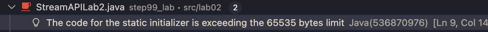
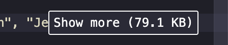

# 중간 연산 과다 사용 / Overusing Intermediate Operations

> [4. Overusing Intermediate Operations:Mistake: Chaining too many intermediate operations (like filter() and map()) can introduce performance overhead.](https://medium.com/javarevisited/7-common-mistakes-in-java-streams-7220f45a8fe8)

## 1. 개요: 중간 연산 과다 사용 (Overusing Intermediate Operations)
스트림 API 사용 시 `filter()`나 `map()`과 같은 중간 연산을 여러 개 사용하는 것은 코드의 가독성을 높일 수 있으나, 시스템의 성능에 영향을 미칠 가능성이 있습니다.

### 1.1 로직 구현 방식 비교
    
* CaseA (비효율): 연산을 단계별로 분리하여 4개의 중간 스트림 생성

    ```Java
    public void run() {
        //출력을 제거하고 결과 생성만 수행
        List<String> result = names.stream()
            .filter(name -> name.startsWith("A"))
            .filter(name -> name.length() > 3)
            .map(String::toUpperCase)
            .map(name -> name + " is a name")
            .toList();
        
        //JIT 최적화로 코드가 삭제되는 것을 방지하기 위해 아주 가끔 결과 확인
        if (result.isEmpty() && System.currentTimeMillis() == 0) System.out.println(result);
    }
    ```

* CaseB (효율): 논리 연산자 (`&&`)와 문자열 결합을 통해 연산 단계를 2개로 줄임

    ```Java
    public void run() {
        //출력을 제거하고 결과 생성만 수행
        List <String> result = names.stream()
            .filter(name -> name.startsWith("A") && name.length() > 3)
            .map(name -> name.toUpperCase() + " is a name")
            .toList();
        
        //JIT 최적화로 코드가 삭제되는 것을 방지하기 위해 아주 가끔 결과 확인
        if (result.isEmpty() && System.currentTimeMillis() == 0) System.out.println(result);
    }
    ```

## 2. 성능 측정 실험 (Benchmark)

### 2.1 실험 환경

* 데이터 개수: 10, 100, 1,000, 10,000개

* 측정 단위: 나노초 (ns)

* 워밍업: 20,000회 (JIT 컴파일러 최적화 유도)

```Java
static void measure(PerformanceTest test) {
    //워밍업 (JIT 컴파일러가 최적화할 시간을 줌)
    for (int i = 0; i < WARMUP; i++) {
        test.run();
    }

    long totalTime = 0;
    long maxTime = Long.MIN_VALUE;
    long minTime = Long.MAX_VALUE;

    //본 측정
    for (int i = 0; i < ITER; i++) {
        long beforeTime = System.nanoTime();
        test.run();
        long afterTime = System.nanoTime();

        long duration = afterTime - beforeTime;
        totalTime += duration;
        maxTime = Math.max(maxTime, duration);
        minTime = Math.min(minTime, duration);
    }

    //결과 출력
    System.out.println("Avg: " + (totalTime / ITER) + " ns");
    System.out.println("Max: " + maxTime + " ns");
    System.out.println("Min: " + minTime + " ns");
}
```

### 2.2 데이터 규모별 성능 측정 결과 (Avg, ns)

| 데이터 크기 | 비효율 (CaseA) | 효율 (CaseB) | 효율 개선율 % |
| --- | --- | --- | --- |
| 10건 | 65 | 47 | 27.7% |
| 100건 | 134 | 107 | 20.2% |
| 1,000건 | 804 | 778 | 3.3% |
| 10,000건 | 6722 | 6716 | 0.1% |

* 두 케이스 모두 최대 시간과 최소 시간이 1,000배 정도 차이가 발생함

    * ex) 데이터가 1,000건인 경우, CaseB에서 max 622481ns min 403ns 측정

## 3. 심층 분석: 성능 수렴의 원인

### 3.1 max값과 min값의 차이가 왜 이렇게 큰가: 측정 노이즈로 인한 결과인가?

1. **Garbage Collection: 일시적인 실행 중단을 유발하며 가장 유력한 원인 중 하나**

2. JIT 재컴파일: 실행 중에 코드를 다시 만들어 성능을 높이는 작업

3. OS Thread Preemption: OS가 우선순위에 따라 실행 중인 스레드를 강제로 중단

4. CPU Cache Flush: 캐시의 데이터를 메모리에 반영하고 무효화하는 과정

5. TLAB 재할당: 스레드가 사용할 메모리를 다시 할당받는 작업

6. Class Loading: 프로그램 실행 중에 필요한 클래스를 메모리에 읽어오는 과정

7. Inline Cache Miss: 미리 예측된 호출 정보를 사용할 수 없어 재확인이 발생하는 경우

### 3.2 두 함수의 시간 차이가 없어졌나? - JVM의 자동 최적화 (JIT Inlining)

* 데이터 규모가 커질수록 상대적으로 개선이 어려운 고정 비용이 큰 비중을 차지

    * 고정 비용: 스트림 엔진 구동, 데이터 소스 로드, 최종 연산

* 결과: 데이터가 10,000건에 도달하면 메모리 I/O와 최종 결과 도출 시간이 전체의 대부분을 점유하여 로직 개선 효과가 미미해짐

* **워밍업: 로직 개선 효과가 미미해지는 이유**

    ```Java
    //워밍업 (JIT 컴파일러가 최적화할 시간을 줌)
    for (int i = 0; i < WARMUP; i++) {
        test.run();
    }
    ```

* 워밍업 이후 JIT는

    1. **람다 인라이닝**

        * 함수를 호출하지 않고 호출할 함수의 본문을 그대로 넣는 것

    2. 루프 합치기

    3. Dead Code Elimination

    4. 분기 예측 최적화

* 이러한 최적화로 인해 Stream 파이프라인의 구조적 차이는 기계어 수준에서 거의 사라진다.

* **즉, 데이터 크기가 커질수록 Stream 구조 차이로 인한 연산 오버헤드는 전체 비용에서 차지하는 비중이 급격히 감소한다.**

## 4. JMH (Java Microbenchmark Harness)

사실 위에서 진행한 실험은 실제 "메소드의 기능"만 포함된 것이 아니다.

```Java
long beforeTime = System.nanoTime();
test.run();
long afterTime = System.nanoTime();
```

* JMH는 JVM을 제어하여 아래와 같은 작업을 자동으로 수행함

    1. 워밍업

    2. GC 분리

    3. Outlier 제거

    4. 통계적 신뢰 구간

    5. Dead Code Elimination 방지


## 5. 결론 및 인사이트

* min/max의 극단적 차이는 [노이즈](#31-max값과-min값의-차이가-왜-이렇게-큰가-측정-노이즈로-인한-결과인가) 때문이며, 이것이 평균을 더 흐리게 만든다.

* 소규모 데이터에서는 로직 개선 (중간 연산 통합)이 전체 성능의 큰 비중을 차지

* 대규모 데이터에서는 개선 불가능한 고정 비용 (연산 비용)이 큰 비중을 차지

* 결과: 데이터가 10,000건에 도달하면 메모리 I/O와 최종 결과 도출 시간이 전체의 대부분을 점유하여 로직 개선 효과가 미미해짐

* 한계점: GC + 연산 지배 전환 + 통계 왜곡으로 인해 정확도가 제한될 수 있음

    * [JMH](#4-jmh-java-microbenchmark-harness)를 통한 테스트가 해결책

## 6. 추가로 알게 된 점

* 동일한 JVM 프로세스에서 벤치마크를 순차적으로 실행할 경우, 앞선 테스트의 JIT 최적화 상태와 캐시 상태가 이후 테스트 결과에 영향을 미칠 수 있음

* 대량의 테스트 데이터를 static으로 유지하는 편이 GC 개입을 줄이고 실행 시간의 분산을 완화하여 전체 측정 안정성을 향상시킴

* 물리적 제약: 64KB 바이트코드 제한 등 JVM의 구조적 한계를 고려한 데이터 로드 전략이 필요

    * 데이터를 반복문이나 외부 파일 로딩이 아닌 코드에 직접 하드코딩하게 되면, 자바 가상 머신 (JVM)의 구조적 제한으로 인해 아래와 같은 에러를 마주하게 됨

        
        

* 10,000개의 짧은 문자열 자체의 크기는 작지만, 이를 하드코딩하면 JVM이 이를 관리하기 위해 수십 배의 메모리 관리 비용을 지불하게 됨...

    

## 7. 추가 실험 과제

* Stream API를 병렬 stream으로 생성해서 데이터를 처리하도록 한다면?

* JMH를 사용해서 노이즈를 최대한 제거한 후 함수"기능"만의 시간은?

* 로그 스케일로 데이터를 더 늘려가며 그래프 같은 시각 자료 필요